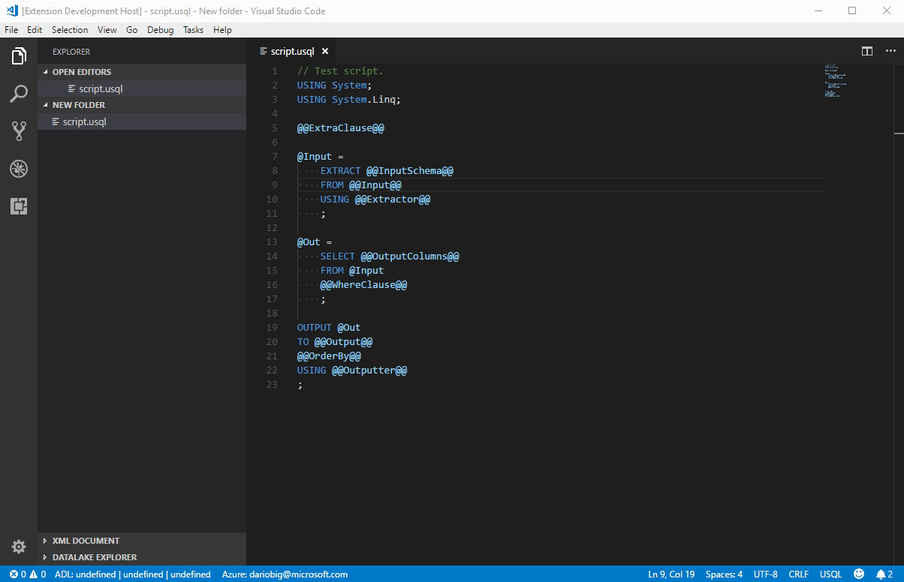
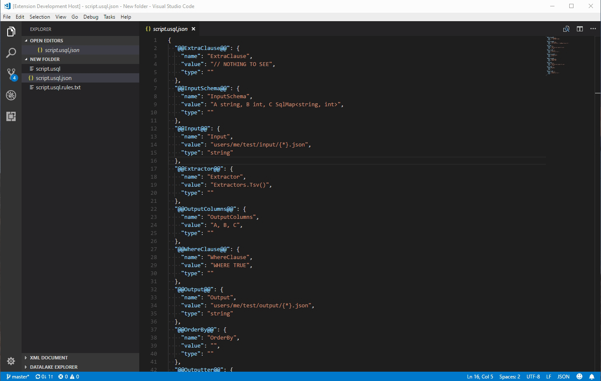

# FriGG README

A text pre-processor to work with parametrized scripts and documents. Extract parameter values to a file, edit it and generate a replaced version. Also, use parameters name, types and values to create custom scripts via templates.

### Replace parameters in template scripts. 
Specify a custom paramter pattern or use the default @@<PARAMETER_NAME>@@.
Parameter values are stored in a separate json file.

If a parameter file is missing a new one will be created with values found in the original file. Once a parameter file is present it will be used to replace values:



Any new parameter added to the original file will be automatically added to the value file as an empty parameter.

Parameter of type string will be automatically wrapped in double quotes, no escaping will be done, so you'll need to handle quoting on your end.

Json files in the same directory and starting with the same name as the original file will be automatically suggested as possible parameter files. Selected parameter files might be overwritte if their content isn't of the right format or there's a content mismatch with the script's parameters.


### Generate custom scripts using templates

Specify a template file, eg:

```json
{
    "Template": "UsqlScript ScriptName=(ScriptName:default,Idf.usql) @@PARAMS@@",
    "Rules": [
        {"TypePattern": "string", "NamePattern": "(Input)([^@]*)", "Format": "PATHIN_${name[2]}={in:EncryptedAzureBlobPath:${name[2]}}"},
        {"TypePattern": "string", "NamePattern": "(Output)([^@]*)", "Format": "OutputReferenceEncrypted_${name[2]}={out:AzureBlobPath:${name[2]}}"},
        {"TypePattern": "int", "NamePattern": "(.*)", "Format": "PARAM_${name[1]}=[(${name[1]}:int,,${value !== '' ? ':default,' + value : ''})]"},
        {"TypePattern": "", "NamePattern": "(.*)", "Format": "PARAM_${name[1]}=\"[(${name[1]})]\""}
    ]
}
```

Then open a parameter file and generate an output script:




## Features

- replace parameters in template files
- parameters auto-discovery and auto-updating
- parameter value serialization
- custom parameter pattern
- use a user defined template file to generate a script / document
- downalod templates from github

## Extension Settings

This extension contributes the following settings:

* `frigg.parameterPattern`: specifies the parameters regex pattern, 
  * defaults to: `@@[^@\\s]+@@`
* `frigg.deleteMissingParams`: if true automatically deletes parameter values from the json file if deleted from the template file
* `frigg.templatesFolder`: set a default folder to store common template files
* `frigg.templatesUrl`: points to a GitHub folder url containing template files to download

## Known Issues

Not yet :)
